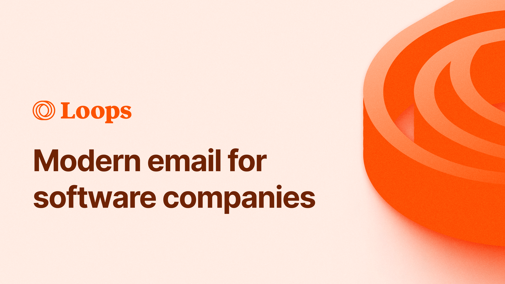

## Summary
Loops makes email marketing for modern SaaS companies easy. It

## Key Details
- **Source:** [loops.so](https://loops.so/)
- **Title:** Loops - The email platform built for SaaS
- **Description:** Loops makes email marketing for modern SaaS companies easy. It

## Visual Assets

