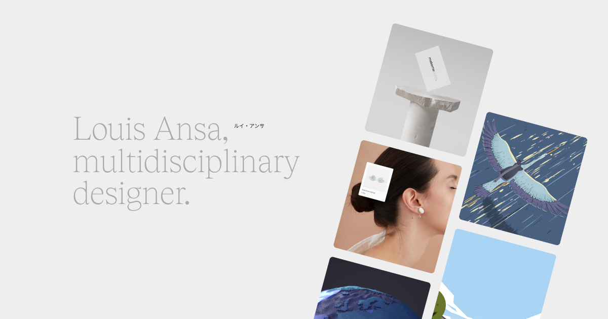

## Summary
Multidisciplinary designer with a knack for animation. My skills range from art direction, web design, product design, motion graphics, 3D design but also strategic design, leadership and management.

## Key Details
- **Source:** [louisansa.com](https://www.louisansa.com/?ref=maxibestof.one)
- **Title:** Louis Ansa - Multidisciplinary designer
- **Description:** Multidisciplinary designer with a knack for animation. My skills range from art direction, web design, product design, motion graphics, 3D design but 

## Visual Assets

