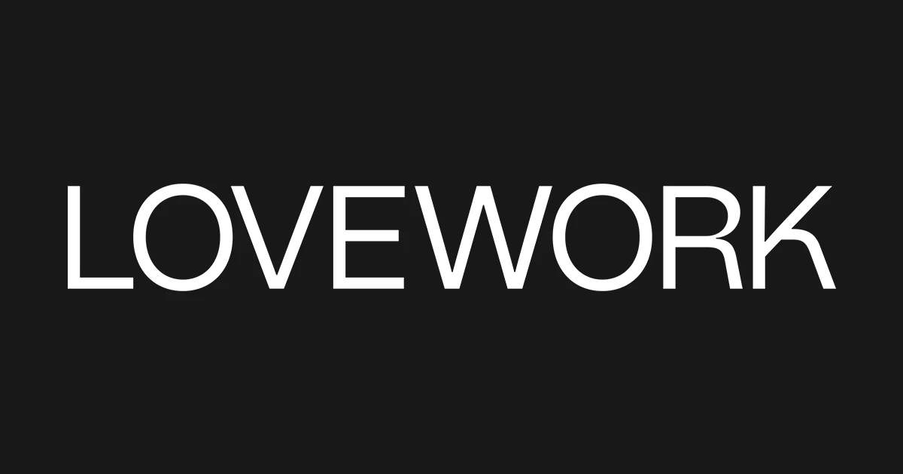

## Summary
Lovework Studio creates brands and experiences that people fall in love with. It is founded by Robyn and Campbell Butler who  have been running  branding and digital projects for 18 years throughout E

## Key Details
- **Source:** [lovework.studio](https://www.lovework.studio/)
- **Title:** Lovework Studio
- **Description:** Lovework Studio creates brands and experiences that people fall in love with. It is founded by Robyn and Campbell Butler who  have been running  brand

## Visual Assets

