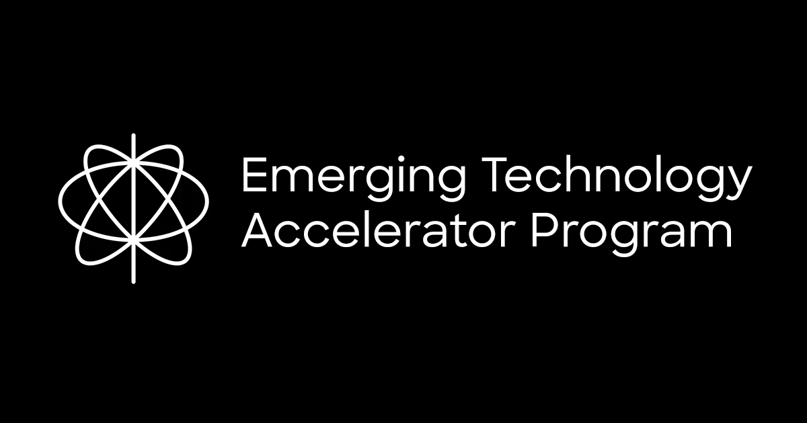

## Summary
The L+R Emerging Technology Accelerator Program offers digital leaders in large organizations complimentary, educational workshops & customized proofs of concept in spatial computing.

## Key Details
- **Source:** [etap.levinriegner.com](https://etap.levinriegner.com/)
- **Title:** L+R Emerging Technology Accelerator Program
- **Description:** The L+R Emerging Technology Accelerator Program offers digital leaders in large organizations complimentary, educational workshops & customized proofs

## Visual Assets

