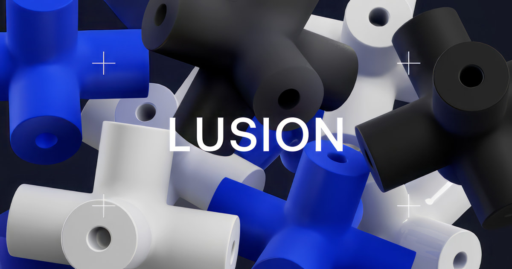

## Summary
We design and produce 3D visual storytelling, immersive websites, and interactive digital experiences that help brands stand out online.

## Key Details
- **Source:** [lusion.co](https://lusion.co/)
- **Title:** Lusion - Award Winning 3D and Interactive Web Studio
- **Description:** We design and produce 3D visual storytelling, immersive websites, and interactive digital experiences that help brands stand out online.

## Visual Assets

