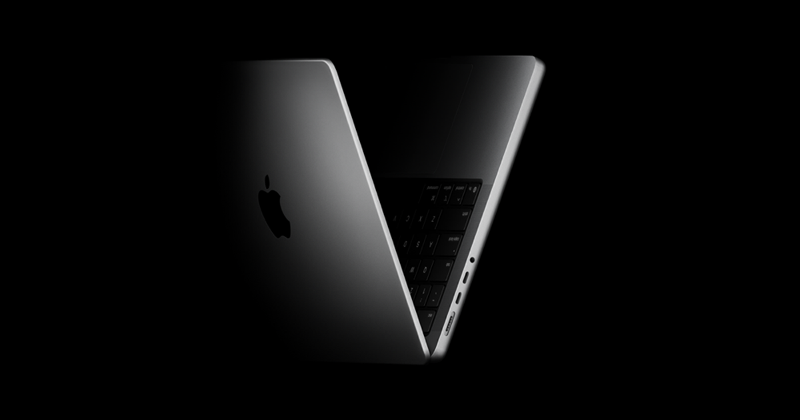

## Summary
Find the best MacBook Pro for you with the M5, M5 Pro, or M5 Max chip. Built for AI. Up to 24 hours of battery life. Liquid Retina XDR display.

## Key Details
- **Source:** [apple.com](https://www.apple.com/macbook-pro/)
- **Title:** MacBook Pro
- **Description:** Find the best MacBook Pro for you with the M5, M5 Pro, or M5 Max chip. Built for AI. Up to 24 hours of battery life. Liquid Retina XDR display.

## Visual Assets

