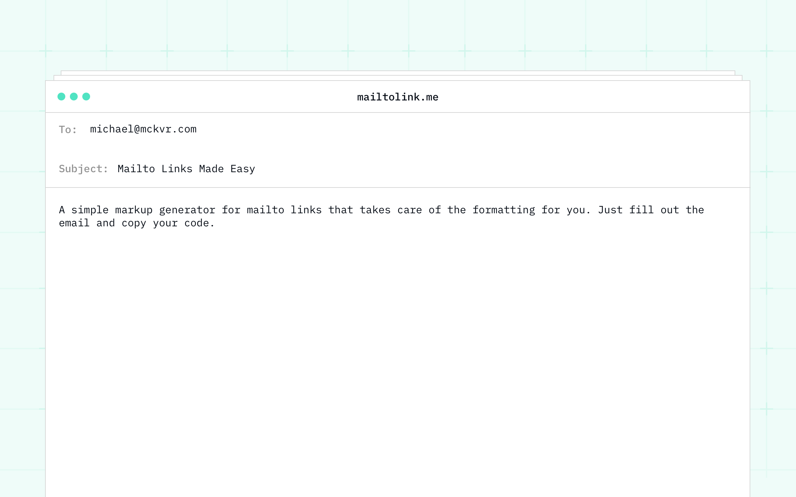

## Summary
Mailto link code and markup generator with subject, body, cc and bcc. Quickly and easily generate code for those annoying mailto links.

## Key Details
- **Source:** [mailtolink.me](https://mailtolink.me/)
- **Title:** Mailtolink.me | The Mailto Link Generator
- **Description:** Mailto link code and markup generator with subject, body, cc and bcc. Quickly and easily generate code for those annoying mailto links.

## Visual Assets

