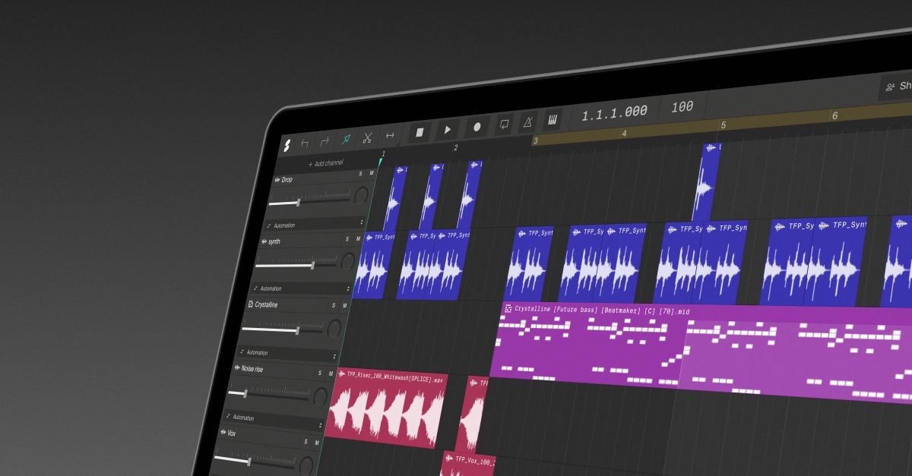

## Summary
Produce music online. Make beats, record audio, and collaborate.

## Key Details
- **Source:** [soundation.com](https://soundation.com/)
- **Title:** Make music in an online DAW
- **Description:** Produce music online. Make beats, record audio, and collaborate.

## Visual Assets

