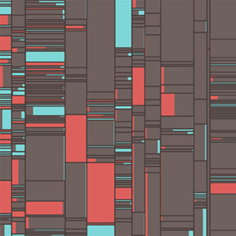

## Summary
Not many people read a dictionary cover to cover, let alone analyze every word, but I did and found it fascinating. During research phases for my past restoration projects, I often came across a surpr

## Key Details
- **Source:** [c82.net](https://www.c82.net/blog/?id=86)
- **Title:** Making of A Brief Visual Exploration of A Dictionary of Typography
- **Description:** Not many people read a dictionary cover to cover, let alone analyze every word, but I did and found it fascinating. During research phases for my past

## Visual Assets

