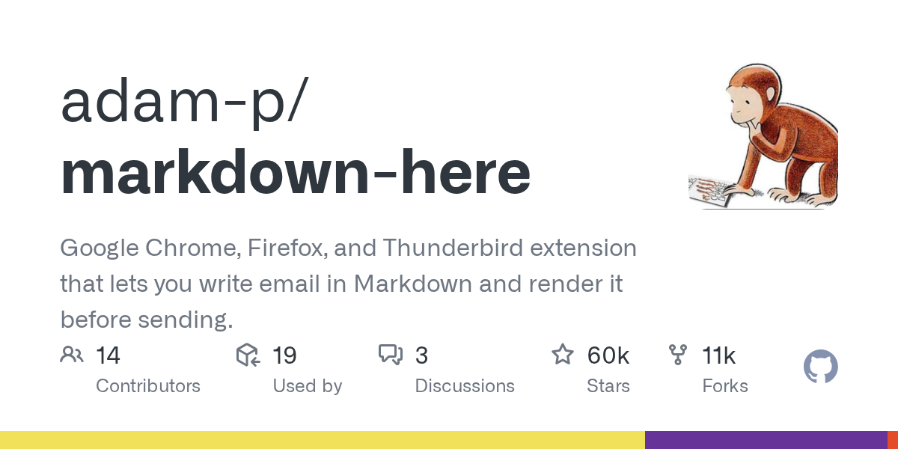

## Summary
Google Chrome, Firefox, and Thunderbird extension that lets you write email in Markdown and render it before sending. - adam-p/markdown-here

## Key Details
- **Source:** [github.com](https://github.com/adam-p/markdown-here/wiki/Markdown-Cheatsheet)
- **Title:** Markdown Cheatsheet
- **Description:** Google Chrome, Firefox, and Thunderbird extension that lets you write email in Markdown and render it before sending. - adam-p/markdown-here

## Visual Assets

