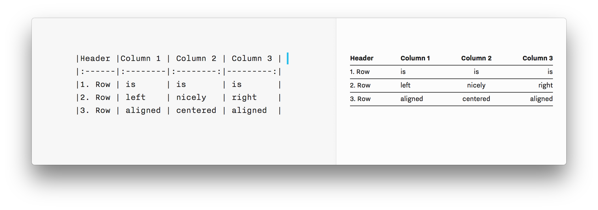

## Summary
If you are not familiar with Markdown, it might look a little scary at first. Once you get the basics, you will quickly love it as it allows you to format your text without taking your hands off the k

## Key Details
- **Source:** [ia.net](https://ia.net/writer/support/basics/markdown-guide#structure)
- **Title:** Markdown Guide: Basics, Tips and Tricks on how to use Markdown
- **Description:** If you are not familiar with Markdown, it might look a little scary at first. Once you get the basics, you will quickly love it as it allows you to fo

## Visual Assets

