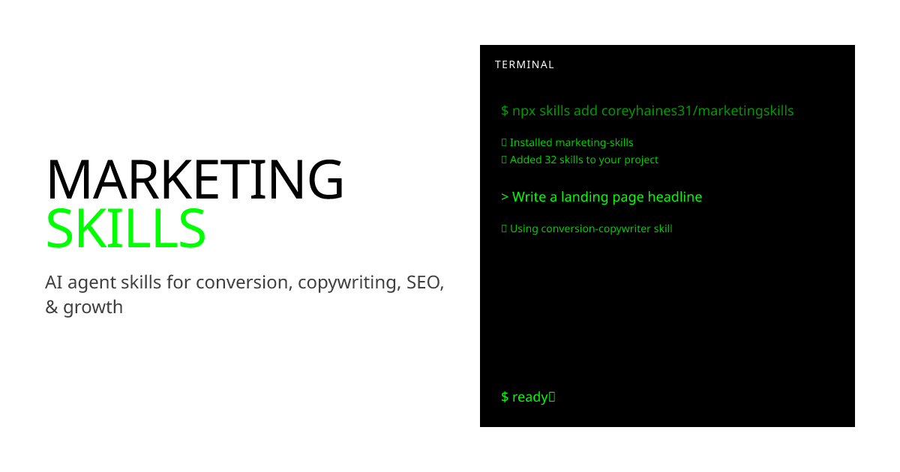

## Summary
AI agent skills for marketing tasks. Conversion optimization, copywriting, SEO, analytics, and growth engineering.

## Key Details
- **Source:** [marketing-skills.com](https://marketing-skills.com/)
- **Title:** Marketing Skills for AI Agents
- **Description:** AI agent skills for marketing tasks. Conversion optimization, copywriting, SEO, analytics, and growth engineering.

## Visual Assets

