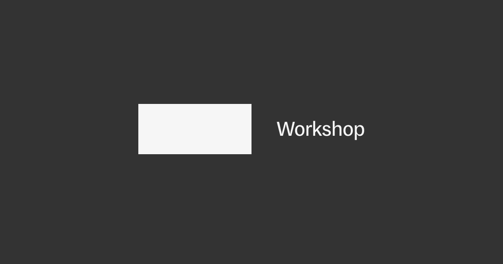

## Summary
The Workshop is a collection of tools for working with fonts, created by Mass-Driver and made available to everyone.

## Key Details
- **Source:** [workshop.mass-driver.com](https://workshop.mass-driver.com/gradients)
- **Title:** Mass-Driver™ Workshop
- **Description:** The Workshop is a collection of tools for working with fonts, created by Mass-Driver and made available to everyone.

## Visual Assets

