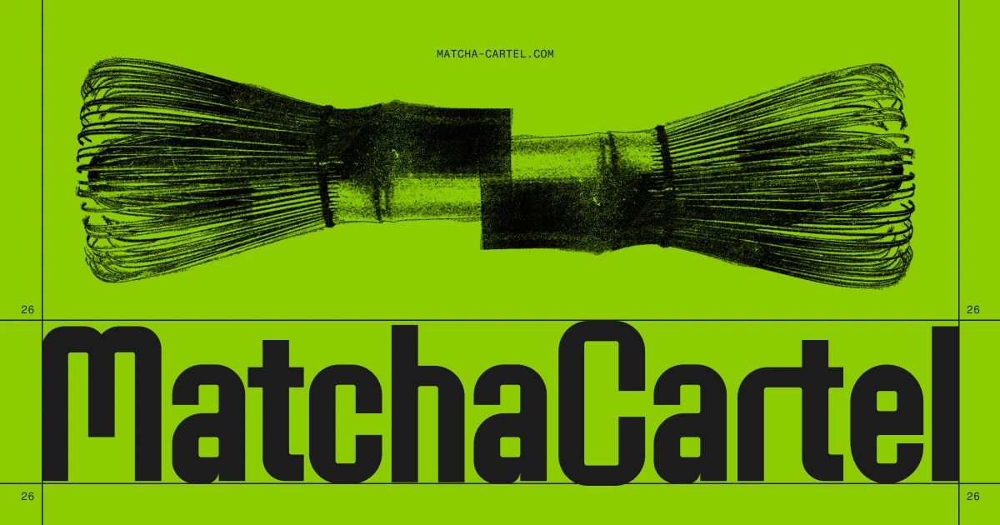

## Summary
An interactive archive exploring the world’s obsession with matcha, reframed as a controlled commodity moving through an underground system.

## Key Details
- **Source:** [matcha-cartel.com](https://matcha-cartel.com/index)
- **Title:** Matcha Cartel
- **Description:** An interactive archive exploring the world’s obsession with matcha, reframed as a controlled commodity moving through an underground system.

## Visual Assets

