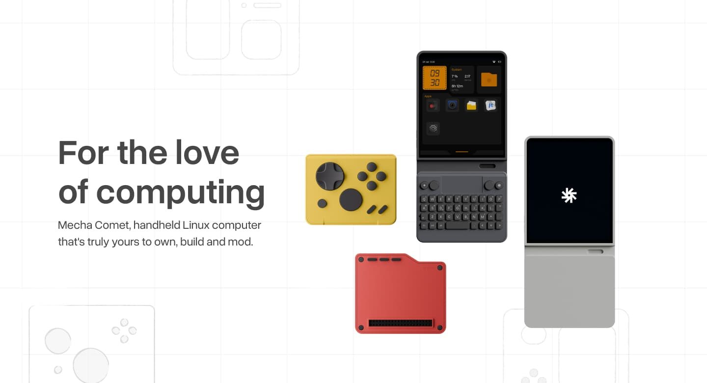

## Summary
A handheld Linux computer powered by open-source software. Modular, programmable, and truly yours to own, build and mod.

## Key Details
- **Source:** [mecha.so](https://mecha.so/comet)
- **Title:** Mecha Comet - Modular Linux Handheld Computer
- **Description:** A handheld Linux computer powered by open-source software. Modular, programmable, and truly yours to own, build and mod.

## Visual Assets

