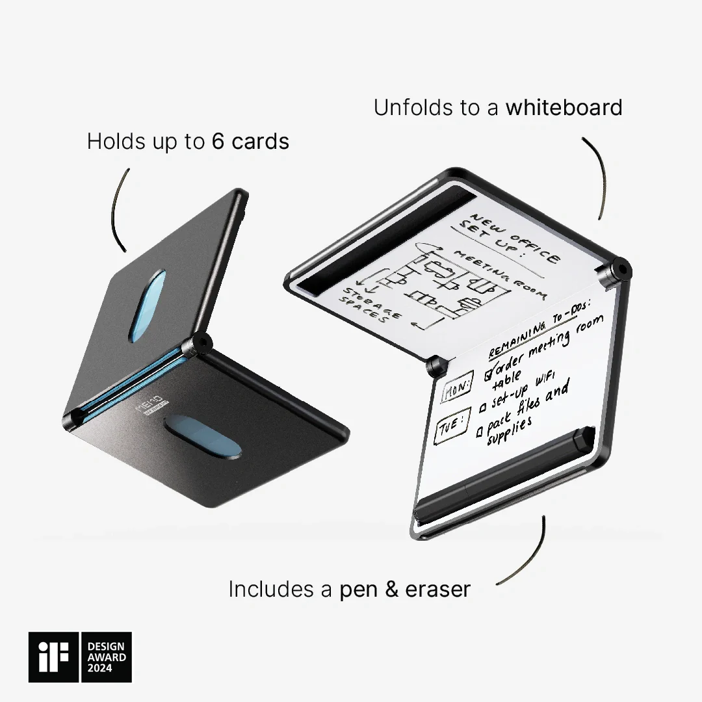

## Summary
Meet MEMO. Whiteboard-in-a-Wallet. It's a wallet. It's a notebook. Crafted from premium materials. This sleek device holds up to 6 cards, a pen and an eraser. But not just that. A 6 inch whiteboard (1

## Key Details
- **Source:** [newthingslab.com](https://newthingslab.com/products/memo-whiteboard-wallet)
- **Title:** MEMO Whiteboard Wallet
- **Description:** Meet MEMO. Whiteboard-in-a-Wallet. It's a wallet. It's a notebook. Crafted from premium materials. This sleek device holds up to 6 cards, a pen and an

## Visual Assets

