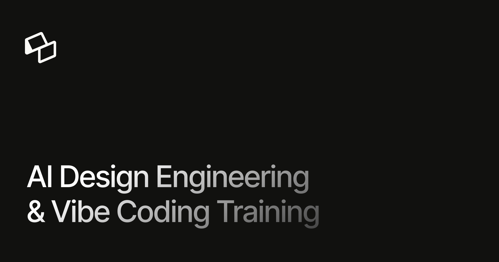

## Summary
Memorisely provides actionable AI design engineering training using Claude Code, Cursor, and Figma MCP. Upskill in design systems, AI prototyping, and vibe coding with hands-on courses and bootcamps.

## Key Details
- **Source:** [memorisely.com](https://www.memorisely.com/)
- **Title:** Memorisely · AI Design Engineering & Vibe Coding Training
- **Description:** Memorisely provides actionable AI design engineering training using Claude Code, Cursor, and Figma MCP. Upskill in design systems, AI prototyping, and

## Visual Assets

