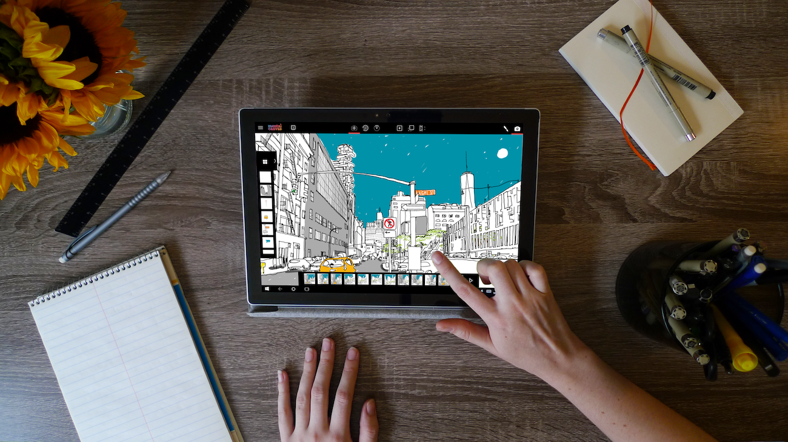

## Summary
Mental Canvas re-imagines drawing for the digital age by augmenting it with spatial strokes, 3D navigation, and animations, all drawn with the ease of pencil and paper. Creatives are using Mental Canv

## Key Details
- **Source:** [mentalcanvas.com](https://www.mentalcanvas.com/)
- **Title:** Mental Canvas re-imagines drawing for the digital age by augmenting it with spatial strokes, 3D navigation, and animations, all drawn with the ease of pencil and paper. Creatives are using Mental Canvas to transform how they develop ideas, share spatial concepts, and engage with audiences around the world.
- **Description:** Mental Canvas re-imagines drawing for the digital age by augmenting it with spatial strokes, 3D navigation, and animations, all drawn with the ease of

## Visual Assets

