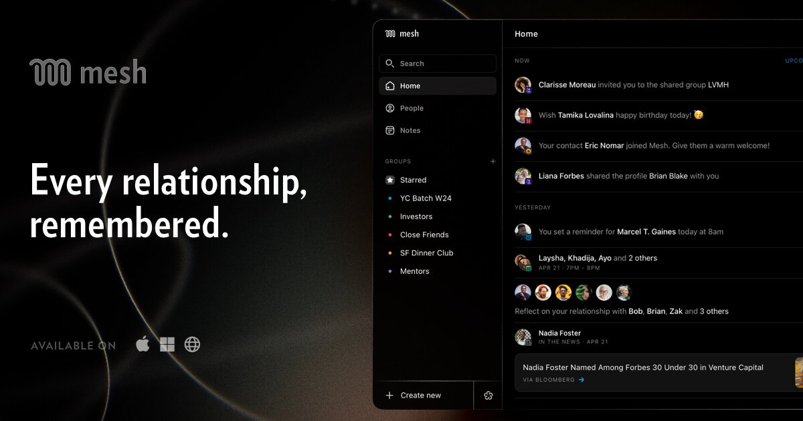

## Summary
Mesh is a beautiful rolodex and CRM for iPhone, Mac, Windows, and web, built automatically to help you manage your personal and professional relationships.

## Key Details
- **Source:** [clay.earth](https://clay.earth/)
- **Title:** Mesh - Be more thoughtful with the people in your network.
- **Description:** Mesh is a beautiful rolodex and CRM for iPhone, Mac, Windows, and web, built automatically to help you manage your personal and professional relations

## Visual Assets

