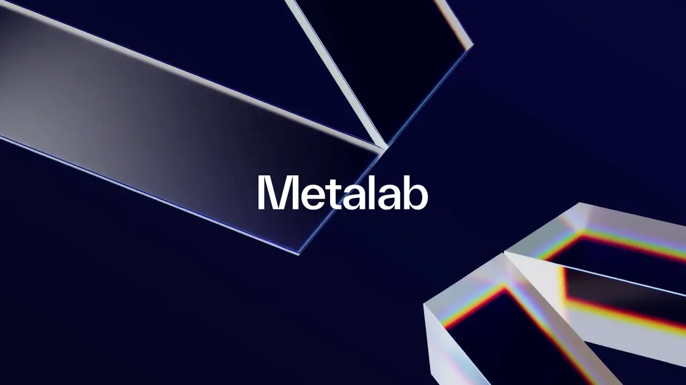

## Summary
Metalab helps some of the world's top companies — like Slack and Google 
 — design, build, and ship amazing products and services.

## Key Details
- **Source:** [metalab.com](https://www.metalab.com/)
- **Title:** Metalab | We make interfaces
- **Description:** Metalab helps some of the world's top companies — like Slack and Google 
 — design, build, and ship amazing products and services.

## Visual Assets

