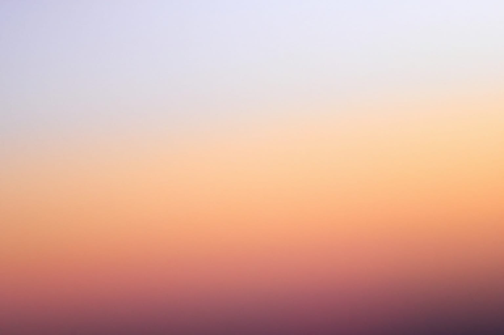

## Summary
An overview of techniques I’ve used to generate random gradient images.

## Key Details
- **Source:** [justinjay.wang](https://justinjay.wang/methods-for-random-gradients/)
- **Title:** Methods for random gradients
- **Description:** An overview of techniques I’ve used to generate random gradient images.

## Visual Assets

