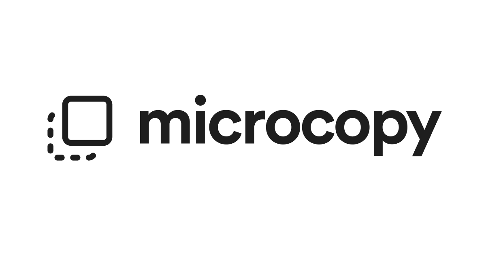

## Summary
Discover 500+ carefully curated microcopies for your website. Find perfect UX writing examples for headlines, CTAs, error messages, and more.

## Key Details
- **Source:** [microcopy.me](https://www.microcopy.me/)
- **Title:** Microcopy - Short Text for Your Website
- **Description:** Discover 500+ carefully curated microcopies for your website. Find perfect UX writing examples for headlines, CTAs, error messages, and more.

## Visual Assets

