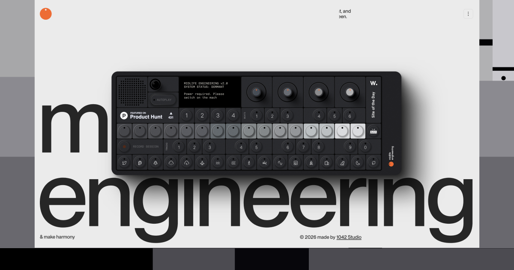

## Summary
Midlife Engineering is a place to play, pause, and reset your head. Interactive sound, gentle experiments, and calm tools for modern brains needing a breather today.

## Key Details
- **Source:** [midlife.engineering](https://www.midlife.engineering/?utm_source=extension&utm_medium=click&utm_campaign=muzli)
- **Title:** Midlife Engineering – Sound therapy for a harmonious mind
- **Description:** Midlife Engineering is a place to play, pause, and reset your head. Interactive sound, gentle experiments, and calm tools for modern brains needing a 

## Visual Assets

