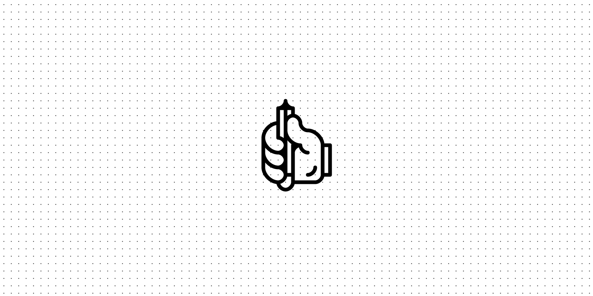

## Summary
minimalist graphical editor in your browser and on the go

## Key Details
- **Source:** [minimator.app](https://minimator.app/?utm_source=densediscovery&utm_medium=email&utm_campaign=newsletter-issue-171)
- **Title:** minimator
- **Description:** minimalist graphical editor in your browser and on the go

## Visual Assets

