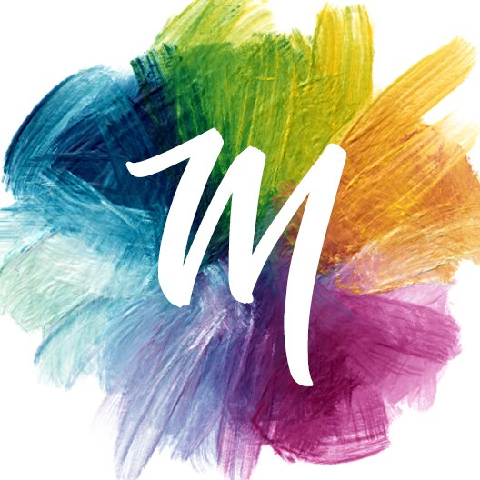

## Summary
Mixbox is a new blending method for natural color mixing. It produces saturated gradients with hue shifts and natural secondary colors during blending. Yellow and blue make green.

## Key Details
- **Source:** [scrtwpns.com](https://scrtwpns.com/mixbox/)
- **Title:** Mixbox - Natural Color Mixing Based on Real Pigments
- **Description:** Mixbox is a new blending method for natural color mixing. It produces saturated gradients with hue shifts and natural secondary colors during blending

## Visual Assets

