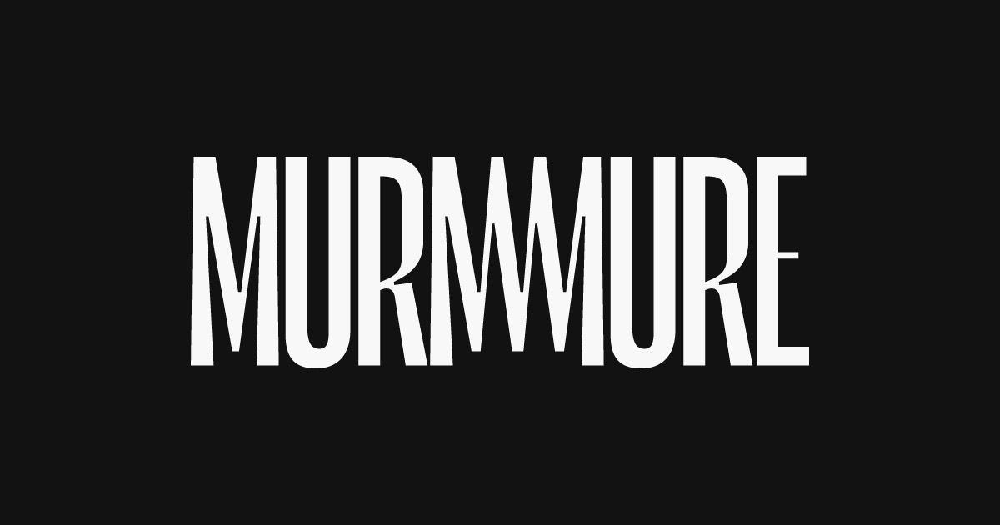

## Summary
Murmure est un studio de direction artistique, de design graphique et numérique, créé en 2010. Composé de Julien Alirol (DA, graphiste, webdesigner), Guillaume Morisseau (développeur front-end) et Pau

## Key Details
- **Source:** [murmure.me](https://murmure.me/)
- **Title:** Murmure - Studio de direction artistique, de design graphique et numérique indépendant
- **Description:** Murmure est un studio de direction artistique, de design graphique et numérique, créé en 2010. Composé de Julien Alirol (DA, graphiste, webdesigner), 

## Visual Assets

