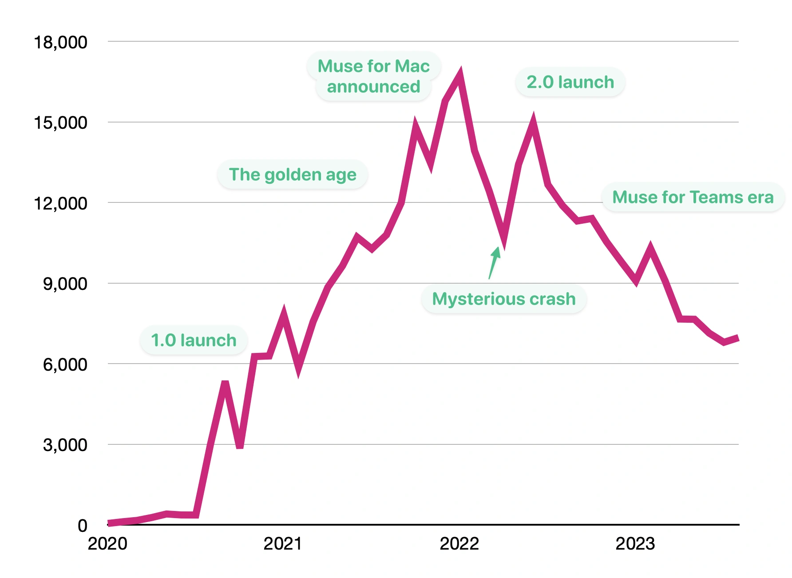

## Summary
The inside story of four years building Muse, a canvas-based thinking tool for iPad and Mac.

## Key Details
- **Source:** [adamwiggins.com](https://adamwiggins.com/muse-retrospective/#golden-age)
- **Title:** Muse retrospective · Adam Wiggins
- **Description:** The inside story of four years building Muse, a canvas-based thinking tool for iPad and Mac.

## Visual Assets

