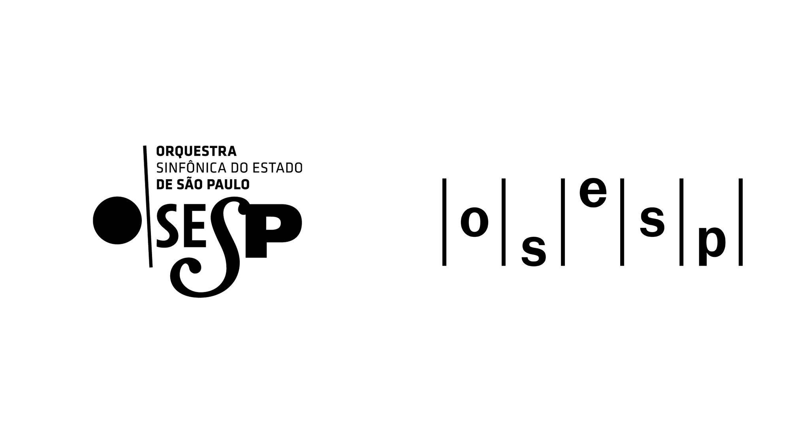

## Summary
New Logo and Identity for São Paulo Symphony Orchestra by Polar

## Key Details
- **Source:** [underconsideration.com](https://www.underconsideration.com/brandnew/archives/new_logo_and_identity_for_sao_paulo_symphony_orchestra_by_polar.php)
- **Title:** Music to my Eyes
- **Description:** New Logo and Identity for São Paulo Symphony Orchestra by Polar

## Visual Assets

