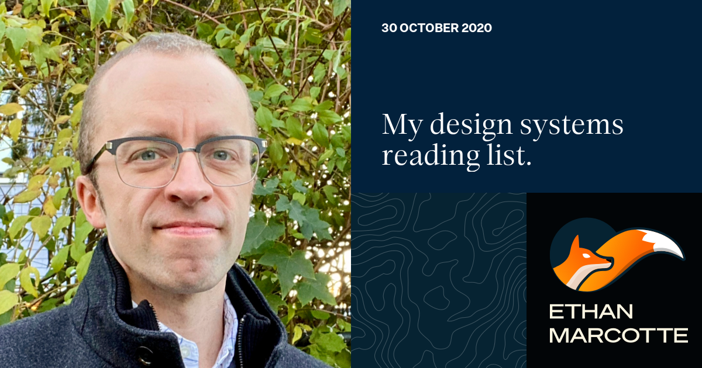

## Summary
A friend asked me to share a few favorite resources on design systems. I thought I’d share them with you, too.

## Key Details
- **Source:** [ethanmarcotte.com](https://ethanmarcotte.com/wrote/my-design-systems-reading-list/)
- **Title:** My design systems reading list. — ethanmarcotte.com
- **Description:** A friend asked me to share a few favorite resources on design systems. I thought I’d share them with you, too.

## Visual Assets

