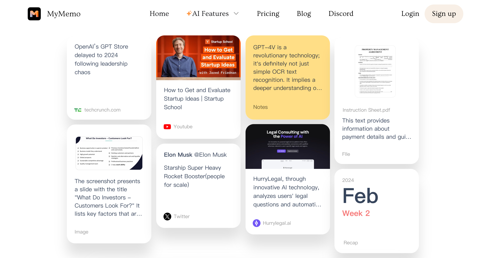

## Summary
Build your digital brain + chat with your personal knowledge use ChatGPT. Harness the Power of AI to Organize, Analyze, and Retrieve Your Digital Knowledge Seamlessly.

## Key Details
- **Source:** [mymemo.ai](https://mymemo.ai/)
- **Title:** MyMemo-Empower Your Mind with AI
- **Description:** Build your digital brain + chat with your personal knowledge use ChatGPT. Harness the Power of AI to Organize, Analyze, and Retrieve Your Digital Know

## Visual Assets

