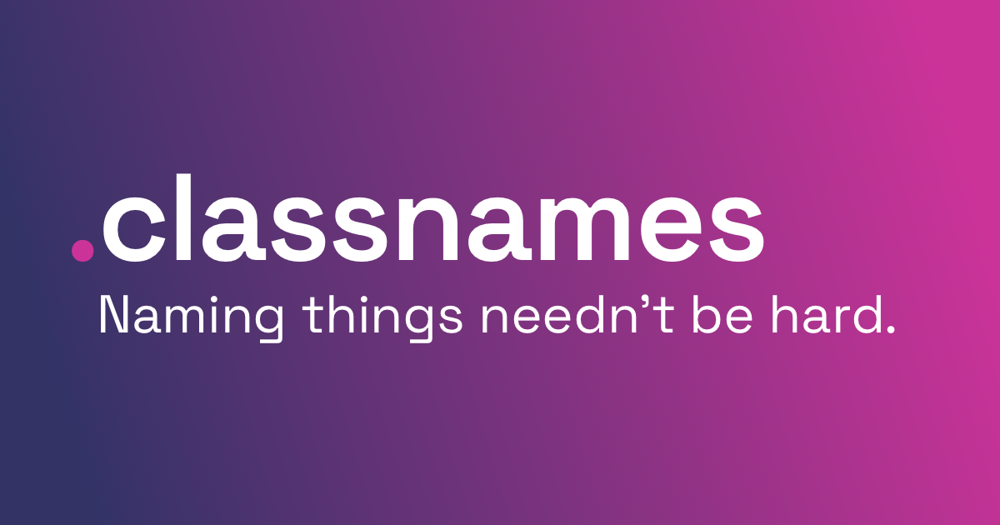

## Summary
Saved from classnames.paulrobertlloyd.com: Naming things needn’t be hard

## Key Details
- **Source:** [classnames.paulrobertlloyd.com](https://classnames.paulrobertlloyd.com/)
- **Title:** Naming things needn’t be hard

## Visual Assets

