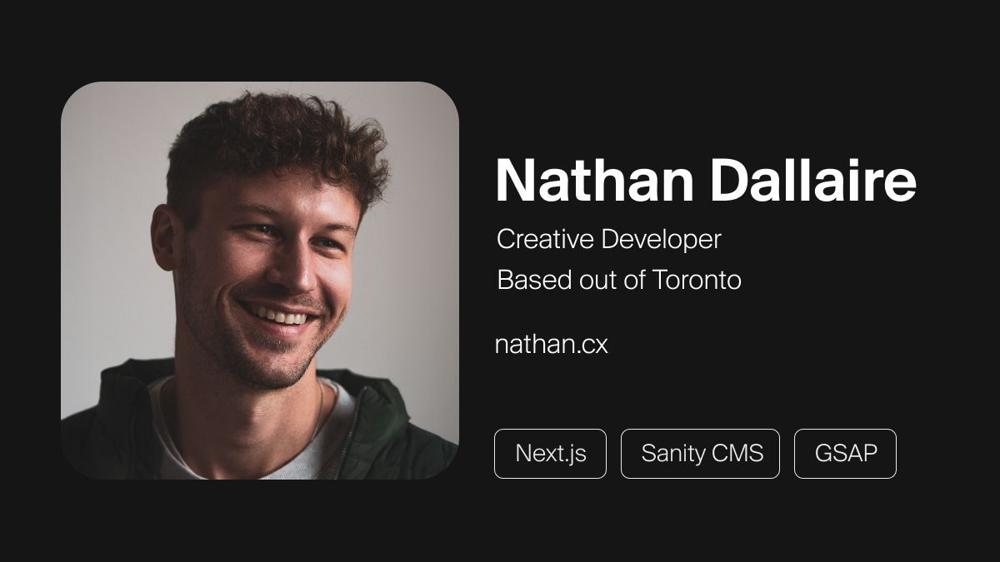

## Summary
Nathan Dallaire is a freelance creative frontend developer based out of Toronto who builds websites with Next.js, Sanity CMS and GSAP

## Key Details
- **Source:** [nathan.cx](https://nathan.cx/)
- **Title:** Nathan Dallaire | Freelance Frontend Developer 
- **Description:** Nathan Dallaire is a freelance creative frontend developer based out of Toronto who builds websites with Next.js, Sanity CMS and GSAP

## Visual Assets

