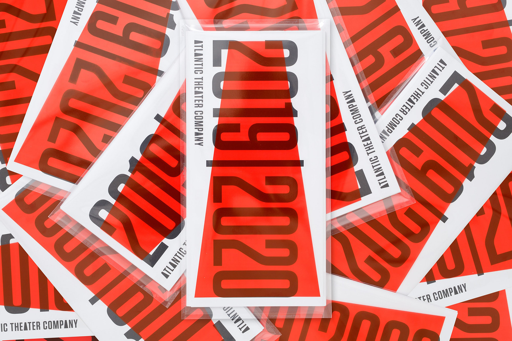

## Summary
Campaign identity and programme by Paul Scher, Pentagram, for the Atlantic Theater's 2019 – 2020 season. Opinion by Richard Baird.

## Key Details
- **Source:** [bpando.org](https://bpando.org/2019/09/12/atlantic-theater-2019-20/)
- **Title:** New Campaign for Atlantic Theater 2019–20 by Pentagram — BP&O
- **Description:** Campaign identity and programme by Paul Scher, Pentagram, for the Atlantic Theater's 2019 – 2020 season. Opinion by Richard Baird.

## Visual Assets

