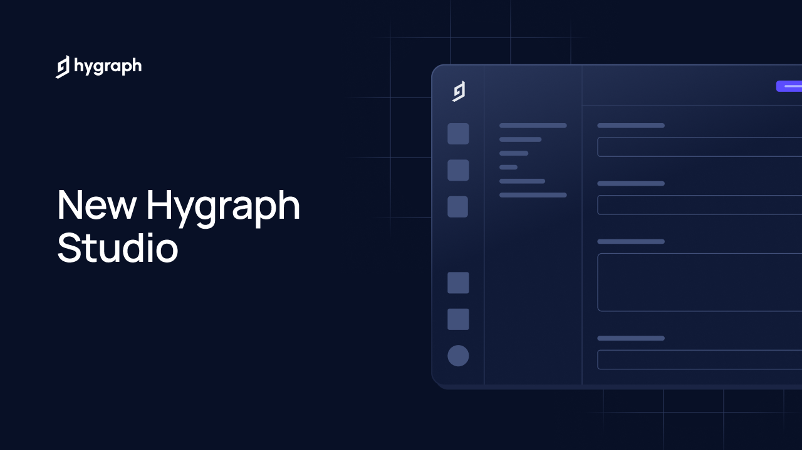

## Summary
Studio is the revamped interface of Hygraph, the next-generation headless CMS. Sign up to use Studio today and experience how it can help you build higher-performance digital applications while empowe

## Key Details
- **Source:** [hygraph.com](https://hygraph.com/hygraph-studio?ref=producthunt)
- **Title:** New Hygraph Studio
- **Description:** Studio is the revamped interface of Hygraph, the next-generation headless CMS. Sign up to use Studio today and experience how it can help you build hi

## Visual Assets

