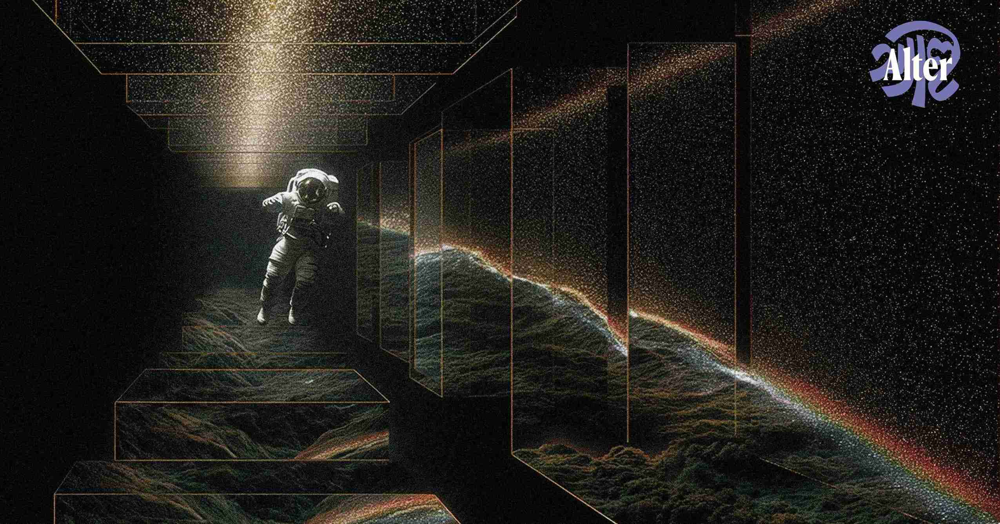

## Summary
Alter Magazine is a monthly journal of ideas documenting the dreams & dilemmas shaping the Subcontinent's aspirations for collective human progress.

## Key Details
- **Source:** [altermag.com](https://altermag.com/)
- **Title:** New Literary Writing on Science, Technology & Progress
- **Description:** Alter Magazine is a monthly journal of ideas documenting the dreams & dilemmas shaping the Subcontinent's aspirations for collective human progress.

## Visual Assets

