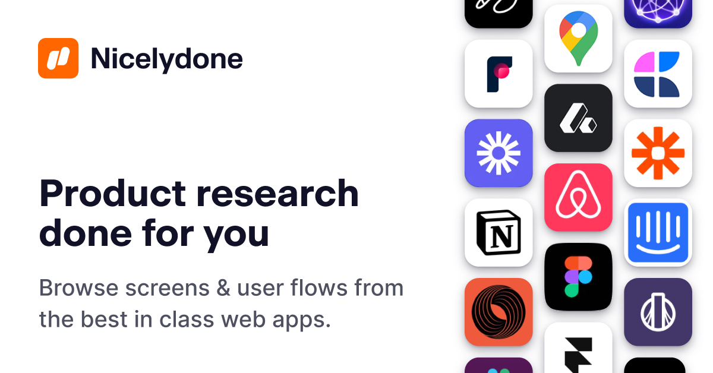

## Summary
Browse a curated design library of web app screens, UI components and User flows from top SaaS web apps, inspiring product teams from leading companies.

## Key Details
- **Source:** [nicelydone.club](https://nicelydone.club/)
- **Title:** Nicelydone — Web apps design inspiration (UX & UI)
- **Description:** Browse a curated design library of web app screens, UI components and User flows from top SaaS web apps, inspiring product teams from leading companie

## Visual Assets

