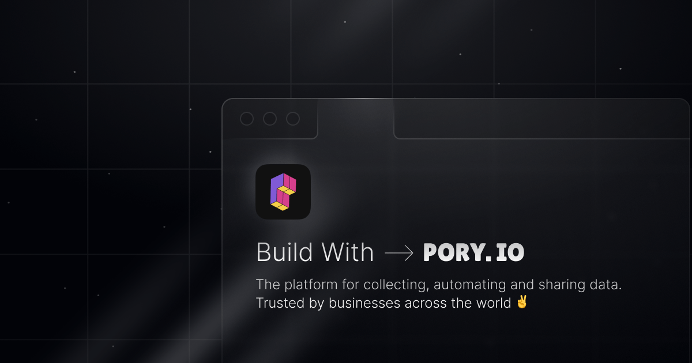

## Summary
Create portals, apps, internal tools and embeddable listings with Airtable. Start with a free no-code template, AI or create your own with Pory.

## Key Details
- **Source:** [pory.io](https://pory.io/)
- **Title:** No-Code App Builder
- **Description:** Create portals, apps, internal tools and embeddable listings with Airtable. Start with a free no-code template, AI or create your own with Pory.

## Visual Assets

