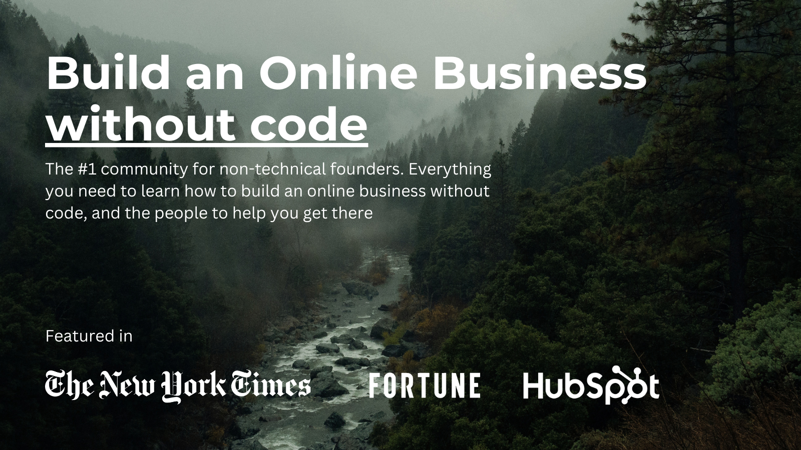

## Summary
No Code Founders is a comprehensive platform designed for entrepreneurs and creators looking to build and grow their online businesses without coding skills. We offer a wealth of resources, including 

## Key Details
- **Source:** [nocodefounders.com](https://nocodefounders.com/)
- **Title:** No Code Founders
- **Description:** No Code Founders is a comprehensive platform designed for entrepreneurs and creators looking to build and grow their online businesses without coding 

## Visual Assets

