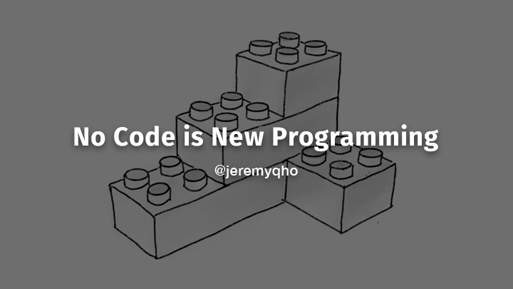

## Summary
Developing perspective on no-code, the visual abstraction of software development.

## Key Details
- **Source:** [jeremyqho.com](https://jeremyqho.com/no-code-is-new-programming)
- **Title:** No Code is New Programming
- **Description:** Developing perspective on no-code, the visual abstraction of software development.

## Visual Assets

