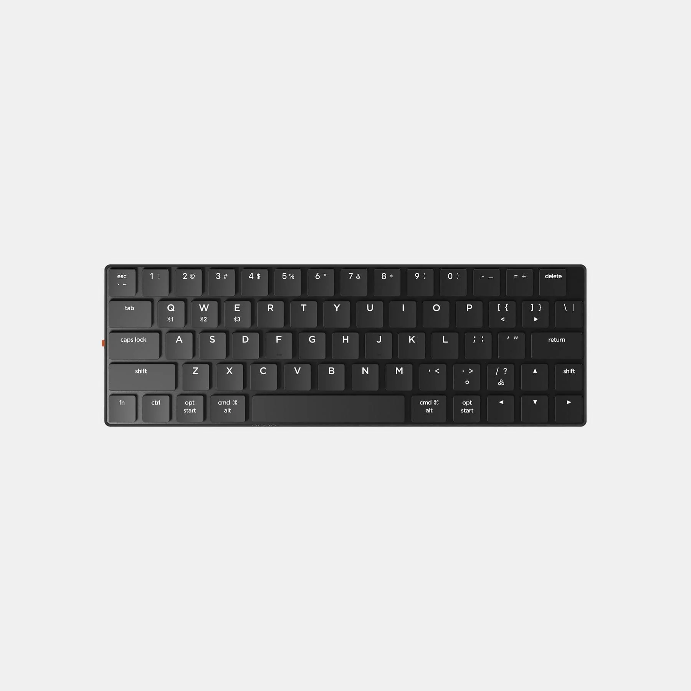

## Summary
The NuType F1 Wireless Mechanical Keyboard features Kailh Choc low-profile mechanical switches, ultra-thin keycaps that measure less than 2mm, and an aluminum frame. The “T” shaped slats at its base a

## Key Details
- **Source:** [nuphy.com](https://nuphy.com/products/nutype-f1?fbclid=PAAaaawKZLZawzOvDqTYhdiLyLICTF3s3OTeBYJyr1OTpt_XXdFzncoMUCraM_aem_ARSv-cQ1rkXLtDyUUfwzJ3T6bAjeabu_YjYZgaVjGtFzGqI-foNPMOpqmKFiq_KUqAgJ-zGwE6j9ct_Hj2LBDYO-Z69wuzttBpwcda4OJWr4uzhR0FbB97K9IOaMm7uXc5A)
- **Title:** NuType F1
- **Description:** The NuType F1 Wireless Mechanical Keyboard features Kailh Choc low-profile mechanical switches, ultra-thin keycaps that measure less than 2mm, and an 

## Visual Assets

