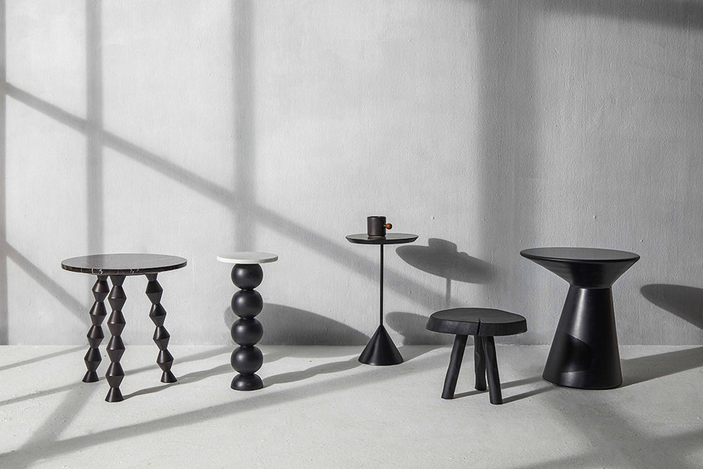

## Summary
The idea behind Objectry is to find joy and celebrate the simplicity of design. We believe in the sensibility that allows a material to lend itself to the design. The approach adopted, paired with Ind

## Key Details
- **Source:** [objectry.com](https://objectry.com/)
- **Title:** Objectry
- **Description:** The idea behind Objectry is to find joy and celebrate the simplicity of design. We believe in the sensibility that allows a material to lend itself to

## Visual Assets

