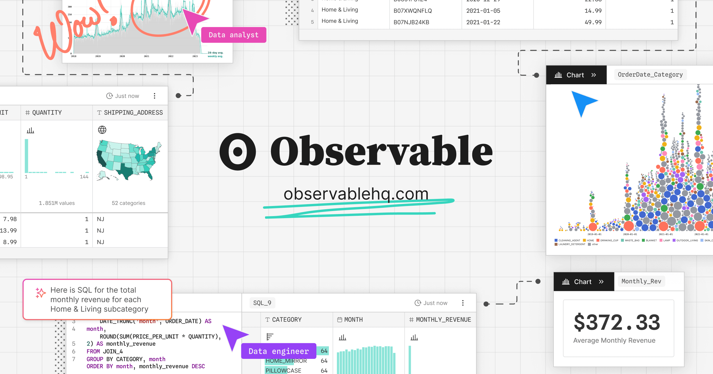

## Summary
Observable is an all-in-one platform for data visualization with tools for developers, data analysts, and collaborators.

## Key Details
- **Source:** [observablehq.com](https://observablehq.com/)
- **Title:** Observable | The modern data visualization platform | Observable
- **Description:** Observable is an all-in-one platform for data visualization with tools for developers, data analysts, and collaborators.

## Visual Assets

