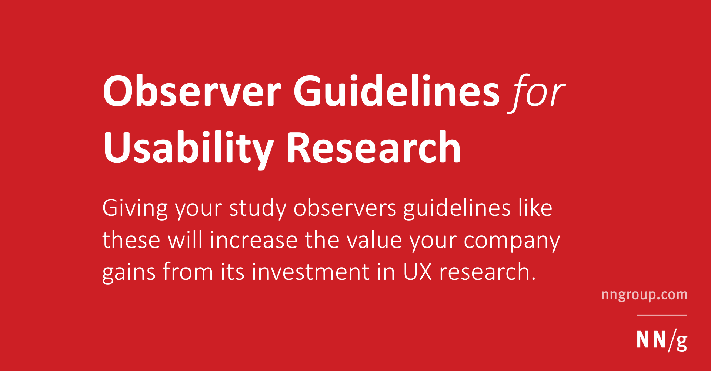

## Summary
Let stakeholders help gather data during user research sessions. Customize this handout for observers to fit your situation.

## Key Details
- **Source:** [nngroup.com](https://www.nngroup.com/articles/observer-guidelines/)
- **Title:** Observer Guidelines for Usability Research
- **Description:** Let stakeholders help gather data during user research sessions. Customize this handout for observers to fit your situation.

## Visual Assets

