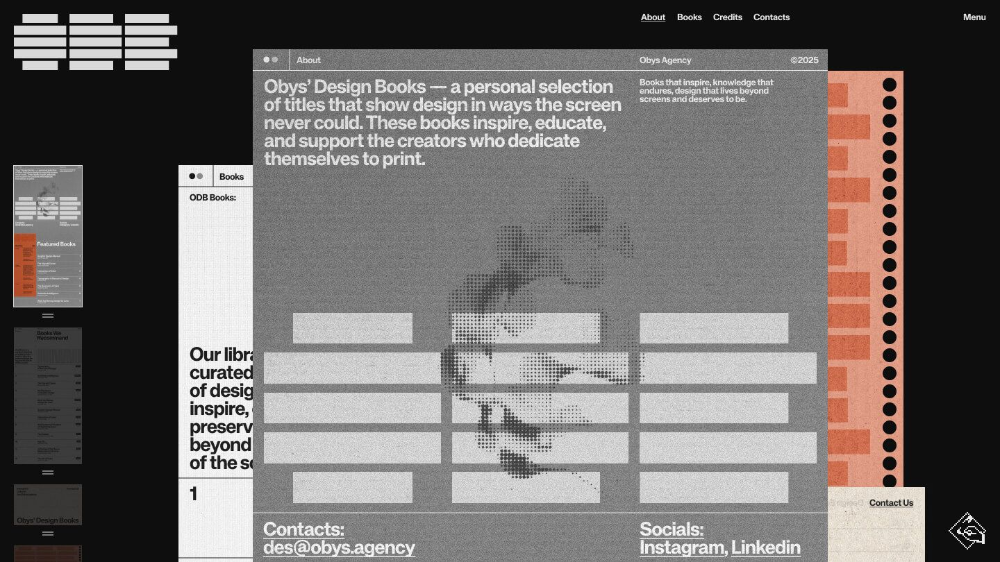

## Summary
Obys’ Design Books — a personal selection of titles that show design in ways the screen never could. These books inspire, educate, and support the creators who dedicate themselves to design.

## Key Details
- **Source:** [library.obys.agency](https://library.obys.agency/)
- **Title:** Obys’ Design Books
- **Description:** Obys’ Design Books — a personal selection of titles that show design in ways the screen never could. These books inspire, educate, and support the cre

## Visual Assets

