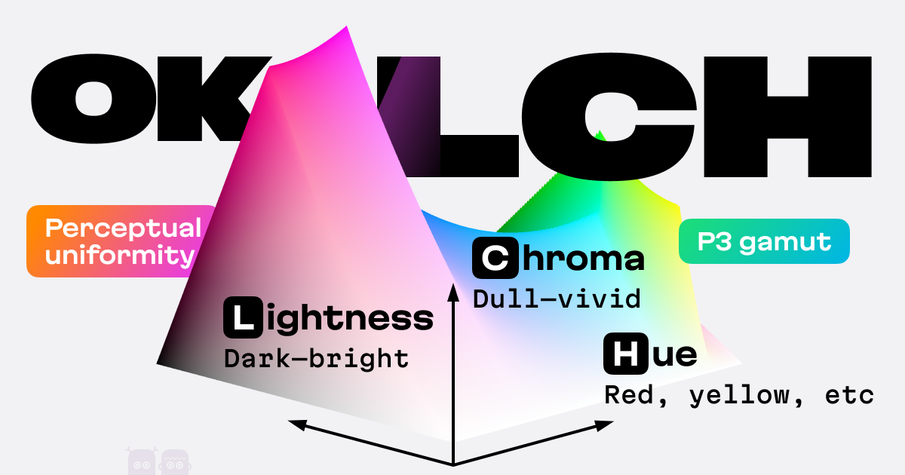

## Summary
OKLCH is a new way to encode colors (like hex, RGBA, or HSL)

## Key Details
- **Source:** [oklch.com](https://oklch.com/#70,0.1,196,100)
- **Title:** OKLCH Color Picker & Converter
- **Description:** OKLCH is a new way to encode colors (like hex, RGBA, or HSL)

## Visual Assets

