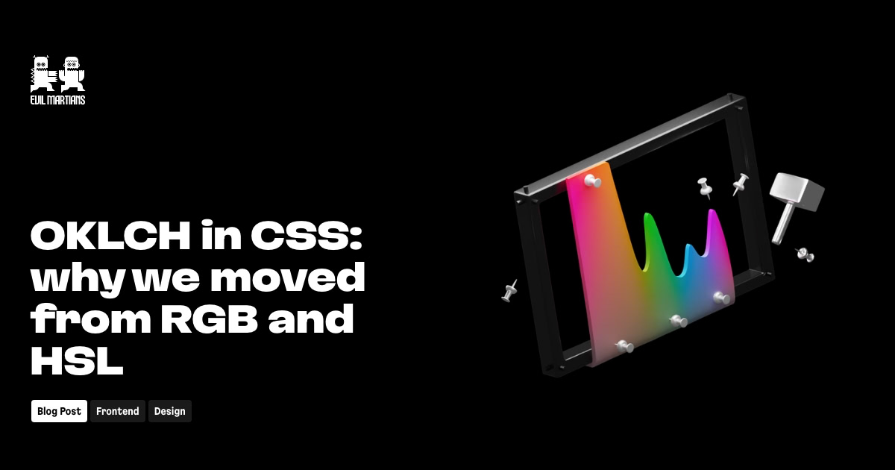

## Summary
CSS Color Module 4 adds oklch(), and we gain P3 wide-gamut support, boost code readability, and improve developer-designer communication.

## Key Details
- **Source:** [evilmartians.com](https://evilmartians.com/chronicles/oklch-in-css-why-quit-rgb-hsl)
- **Title:** OKLCH in CSS: why we moved from RGB and HSL—Martian Chronicles, Evil Martians’ team blog
- **Description:** CSS Color Module 4 adds oklch(), and we gain P3 wide-gamut support, boost code readability, and improve developer-designer communication.

## Visual Assets

