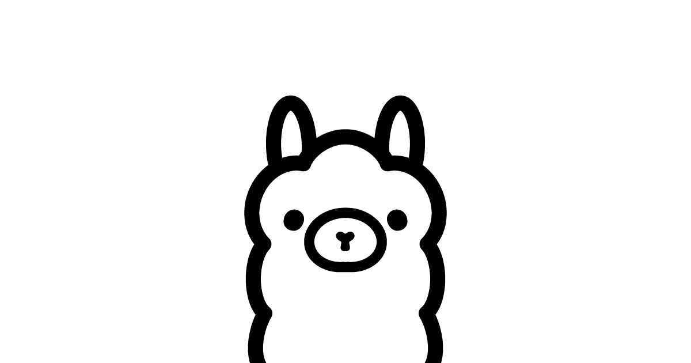

## Summary
Ollama is the easiest way to automate your work using open models, while keeping your data safe.

## Key Details
- **Source:** [ollama.com](https://ollama.com/)
- **Title:** Ollama
- **Description:** Ollama is the easiest way to automate your work using open models, while keeping your data safe.

## Visual Assets

