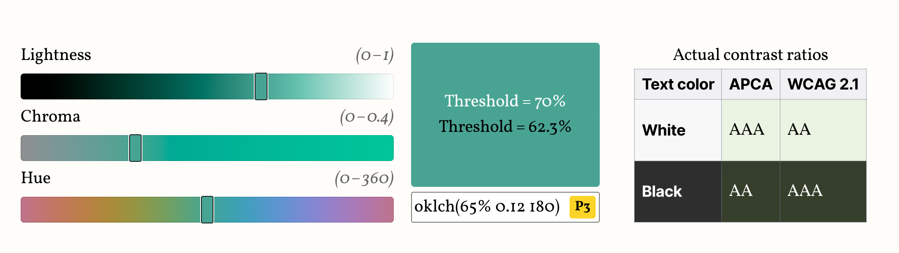

## Summary
Saved from lea.verou.me: 
		On compliance vs readability: Generating text colors with CSS • Lea Verou

## Key Details
- **Source:** [lea.verou.me](https://lea.verou.me/blog/2024/contrast-color/)
- **Title:** 
		On compliance vs readability: Generating text colors with CSS • Lea Verou

## Visual Assets

