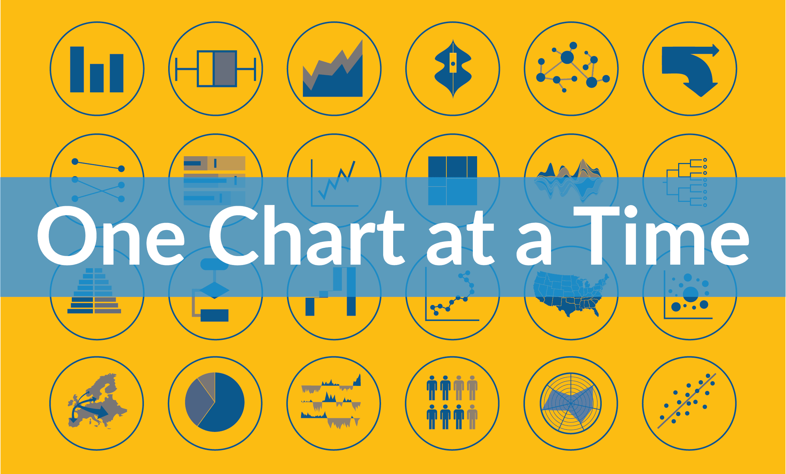

## Summary
Learn about more than 50 graphs, charts, and diagrams in the One Chart at a Time video series presented by PolicyViz.

## Key Details
- **Source:** [policyviz.com](https://policyviz.com/2021/01/11/one-chart-at-a-time-video-series/)
- **Title:** One Chart at a Time Video Series - PolicyViz
- **Description:** Learn about more than 50 graphs, charts, and diagrams in the One Chart at a Time video series presented by PolicyViz.

## Visual Assets

