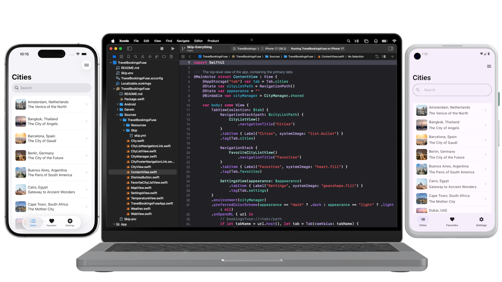

## Summary
Skip lets you write one app in Swift and SwiftUI and ship it natively on both iOS and Android.

## Key Details
- **Source:** [skip.tools](https://skip.tools/)
- **Title:** One Swift Codebase. Two Native Platforms.
- **Description:** Skip lets you write one app in Swift and SwiftUI and ship it natively on both iOS and Android.

## Visual Assets

